<div align="center">
  

  # WOL-F · Wake-On-LAN Fleet

  **A modern, security-hardened Wake/Sleep-on-LAN fleet manager — wake and shut down the computers on your LAN from a clean web GUI.**

  _by **[MaikiMolto](https://github.com/MaikiMolto) & Nex** · inspired by [GPTWOL](https://github.com/Misterbabou/gptwol)_
</div>

---

WOL-F is a lightweight, self-hosted web app to **wake up** (Wake-on-LAN) and **shut down** (Sleep-on-LAN) the computers on your LAN — with per-device scheduling, live status checks, an ARP network scanner, optional login, optional built-in HTTPS, and a polished dark/light, DE/EN interface.

> **Inspired by [GPTWOL](https://github.com/Misterbabou/gptwol)** (MIT © Misterbabou). WOL-F is a heavily reworked fork: redesigned UI, full DE/EN i18n, security hardening (CSRF tokens, security headers, login rate-limiting, persistent secret key), optional built-in HTTPS, mobile fixes and more.

## ✨ Highlights

- 🎨 **Modern redesigned UI** — polished dark & light theme, fully responsive (desktop + mobile), **DE / EN** with live language switching
- 🎚️ **Smart status switches** — every device has a sliding toggle that *is* its live status (online · offline · booting · shutting down) and wakes or sleeps it with a single flip
- 🧙 **Beginner-friendly scheduler** — automate wake & shutdown without touching cron: presets (weekdays · daily · weekend), weekday toggles and a simple time picker
- 🔒 **Security-first by design** — CSRF protection, hardened session cookies, **persistent rate-limiting** (SQLite, shared across workers) and a **fail-closed rule: HTTPS *requires* login**
- 📡 **Your whole LAN in one view** — live status (ICMP / ARP / TCP), built-in **ARP scanner** to discover devices, plus search & sort
- 🪶 **Self-hosted & lightweight** — one container, ~75 MB RAM (a single gunicorn worker by default), no cloud, no account, no telemetry

## Features

**Core**
- 🔌 **Wake-on-LAN** — send magic packets to wake computers
- 😴 **Sleep-on-LAN** — shut computers down (via [SR-G/sleep-on-lan](https://github.com/SR-G/sleep-on-lan))
- 🎚️ **Smart per-device switch** — flip to wake/sleep with a live *pending* animation (booting / shutting down); plus **bulk wake / bulk shutdown** for the whole fleet at once
- 📡 **Live status** — ICMP ping, ARP or TCP port checks (configurable timeouts)
- 🔍 **ARP network scan** to discover & add devices
- ➕ **Add / edit / delete** devices · 🔎 **search** by name/MAC/IP · **sort** by name/IP/MAC

**Scheduling**
- ⏰ **Beginner-friendly cron builder** — presets (weekdays/daily/weekend), weekday toggles & time picker; no cron syntax required (expert cron still available)

**Security & access**
- 🔐 **Optional login** (single user) — CSRF-protected, **rate-limited (persistent, SQLite-backed)**, hardened session cookie
- 🔒 **Optional built-in HTTPS** — self-signed cert auto-generated, no reverse proxy required
- 🛡️ **HTTPS enforces login** — WOL-F **refuses to start** if HTTPS is enabled but login is off → no unauthenticated device control over HTTPS
- 🔑 **Persistent secret key** — stable sessions across restarts (race-safe on fresh installs)

**Experience**
- 🌗 **Dark & light mode** · 🌍 **DE / EN** live switching
- 📱 Responsive (desktop + mobile), tiny footprint (~75 MB RAM with the default 1 worker / 4 threads)

## Screenshots

| Dark mode | Light mode |
| --- | --- |
| 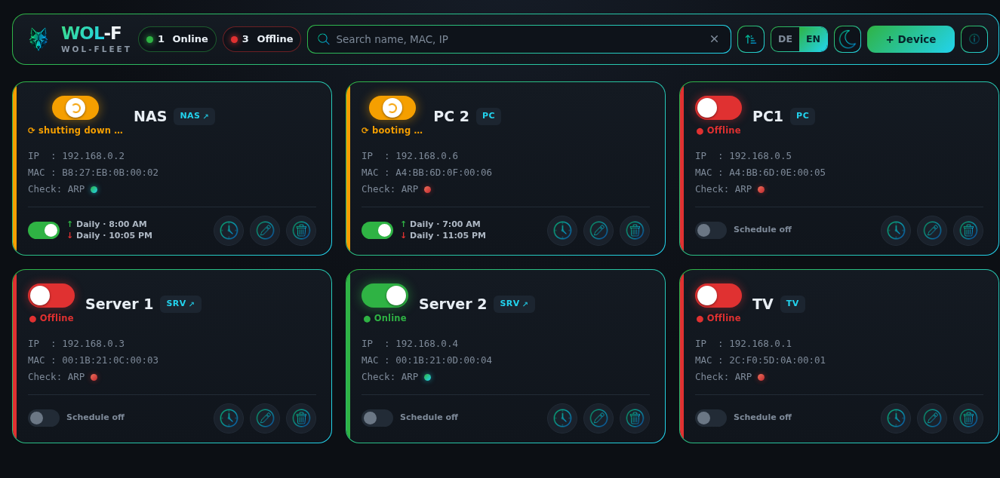 | 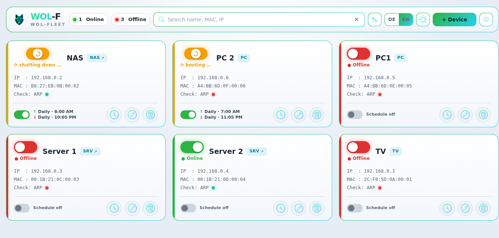 |

### Dialogs & actions

| Feature | Dark mode | Light mode |
| --- | --- | --- |
| Add Device | 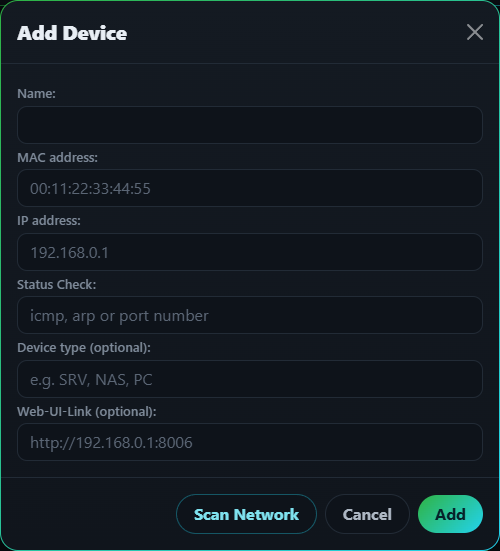 | 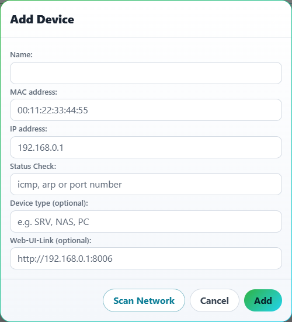 |
| Edit Device | 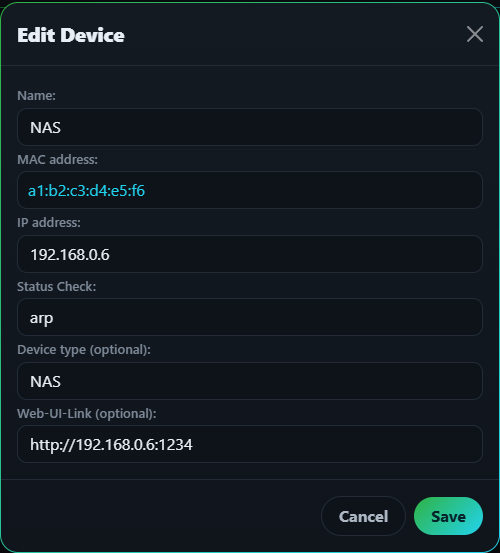 | 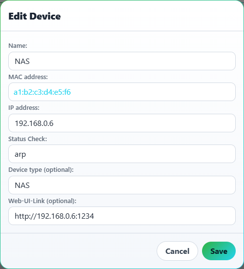 |
| Schedule | 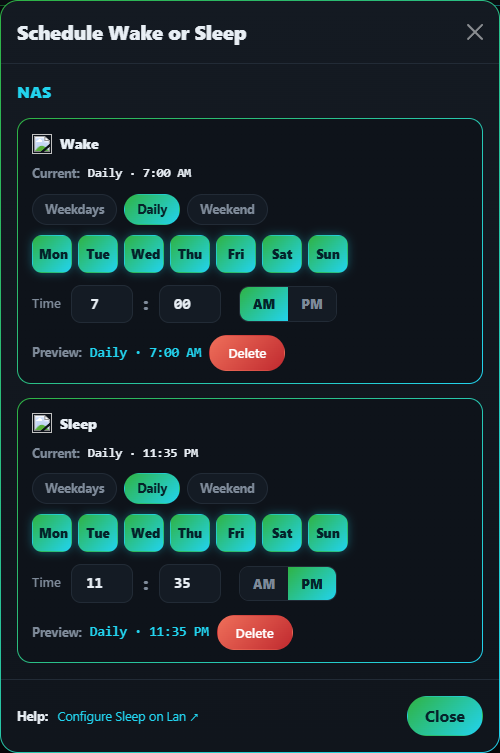 | 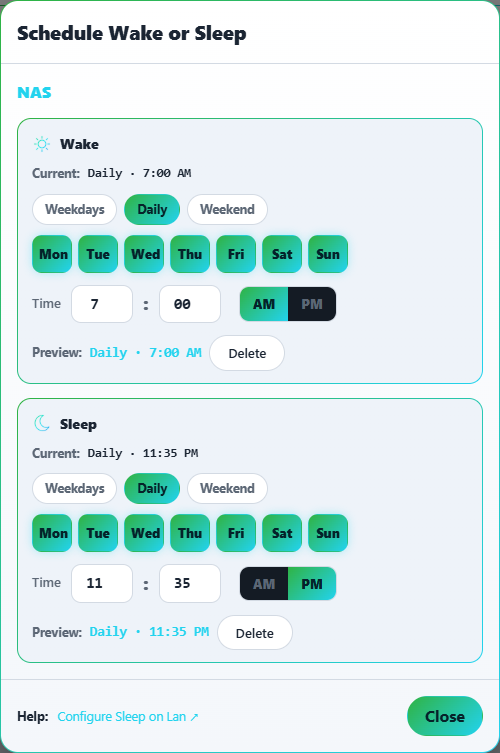 |
| Wake confirmation | 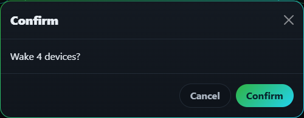 | 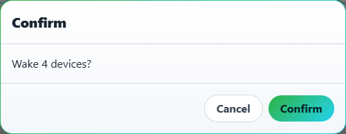 |
| Shutdown confirmation | 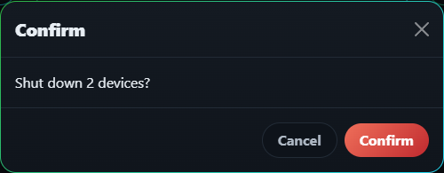 | 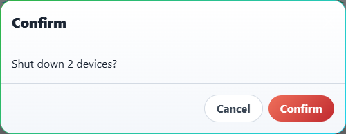 |
| Login | 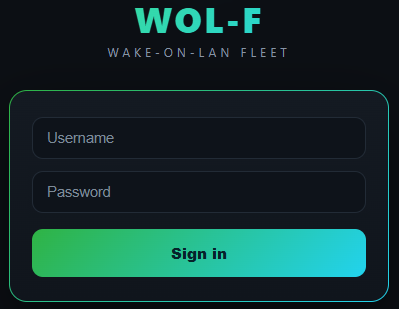 | — |

## Quick start (Docker)

> [!CAUTION]
> - The container must run in **host network mode** to send WOL packets on your LAN.
> - Make sure the chosen `PORT` is free on your host.
> - Make sure BIOS/OS is configured to allow Wake-on-LAN.
> - Don't expose WOL-F to the internet without protection — enable login + HTTPS, or put it behind a reverse proxy.

### Deploy with Docker Compose / Portainer

Paste one of these stacks into **Portainer → Stacks → Add stack**, or save it as `compose.yaml` and run `docker compose up -d`. The stacks pull the image straight from **GitHub Container Registry** (`ghcr.io/maikimolto/wol-f:latest`) — no build needed. Prefer building yourself? See [Build from source](#build-from-source).

**🔓 Minimal — HTTP on your LAN**
```yaml
services:
  wol-f:
    container_name: wol-f
    image: ghcr.io/maikimolto/wol-f:latest
    network_mode: host
    restart: unless-stopped
    environment:
      - TZ=Europe/Berlin
      - PORT=2600
      - LANGUAGE=de
    volumes:
      - ./appdata/db:/app/db
      - ./appdata/cron:/etc/cron.d
```

**🔒 Recommended — HTTPS + login (built-in self-signed cert)**
```yaml
services:
  wol-f:
    container_name: wol-f
    image: ghcr.io/maikimolto/wol-f:latest
    network_mode: host
    restart: unless-stopped
    environment:
      - TZ=Europe/Berlin
      - PORT=2601
      - LANGUAGE=de
      - ENABLE_HTTPS=true         # serve HTTPS directly (self-signed cert auto-generated)
      - ENABLE_LOGIN=true         # REQUIRED whenever HTTPS is enabled
      - USERNAME=admin
      - PASSWORD=change-me-please  # set a strong password!
    volumes:
      - ./appdata/db:/app/db
      - ./appdata/cron:/etc/cron.d
```

> ℹ️ All available options are listed under [Configuration](#configuration).

### docker run

```
docker run -d --name wol-f --network host --restart unless-stopped \
  -e TZ=Europe/Berlin -e PORT=2600 \
  -v ./appdata/db:/app/db -v ./appdata/cron:/etc/cron.d \
  ghcr.io/maikimolto/wol-f:latest
```

### Build from source

```
git clone https://github.com/MaikiMolto/WOL-F.git && cd WOL-F
docker build -t wol-f:latest .
```

## Configuration

| Variable | Default | Description |
| --- | --- | --- |
| `TZ` | `UTC` | Timezone (used for cron) |
| `PORT` | `2600` | Web UI port |
| `IP` | `0.0.0.0` | Listen address (IPv4/IPv6) |
| `LANGUAGE` | `de` | UI default language (`de` / `en`) |
| `LOG_LEVEL` | `INFO` | `DEBUG` / `INFO` / `WARN` / `ERROR` |
| `ENABLE_LOGIN` | `false` | Enable single-user login |
| `USERNAME` | `admin` | Login username |
| `PASSWORD` | — | **Required when `ENABLE_LOGIN=true`** (app refuses to start without it) |
| `SECRET_KEY` | _auto_ | Flask secret for sessions/CSRF; auto-persisted in `/app/db` if unset |
| `ENABLE_HTTPS` | `false` | Serve HTTPS directly with a self-signed cert (no reverse proxy needed) · **requires `ENABLE_LOGIN=true`** |
| `SSL_CERT` / `SSL_KEY` | `/app/db/wol-f-*.pem` | Custom TLS cert/key (used with `ENABLE_HTTPS`; auto-generated if missing) |
| `SESSION_COOKIE_SECURE` | `false` | Send session cookie only over HTTPS (auto-on with `ENABLE_HTTPS`) |
| `ENABLE_ADD_DEL` | `true` | Show add/delete buttons |
| `ENABLE_REFRESH` | `true` | Auto status refresh |
| `REFRESH_INTERVAL` | `30` | Status check interval (s) |
| `PING_TIMEOUT` | `300` | Ping timeout (ms) |
| `ARP_INTERFACE` | — | ARP interface for scan/test |
| `ARP_TIMEOUT` | `300` | ARP timeout (ms) |
| `TCP_TIMEOUT` | `1` | TCP check timeout (s) |
| `ENABLE_L2_WOL_PACKET` | `false` | Use an L2 WOL packet instead of L4 |
| `L2_INTERFACE` | `eth0` | Interface for L2 WOL |
| `SCRIPT_NAME` | — | Run the app under a subpath |
| `GUNICORN_WORKERS` | `1` | Gunicorn worker processes — 1 is plenty for a home LAN; raise it only for many concurrent users |
| `GUNICORN_THREADS` | `4` | Threads per worker — keeps parallel status checks snappy |
| `GUNICORN_TIMEOUT` | `60` | Worker timeout (s) |

> [!TIP]
> **Sizing / performance.** The defaults (`GUNICORN_WORKERS=1`, `GUNICORN_THREADS=4`) are tuned for a typical single-user home LAN: **~75 MB RAM** and a snappy UI even when refreshing many devices at once (status checks are short, I/O-bound calls that the 4 threads run in parallel). Only raise `GUNICORN_WORKERS` if several people use the UI simultaneously — each extra worker adds ~55–60 MB.

## Access & HTTPS

> [!IMPORTANT]
> **HTTPS enforces authentication.** Enabling `ENABLE_HTTPS=true` **requires** `ENABLE_LOGIN=true` — otherwise WOL-F refuses to start. Your device-control panel is never served over HTTPS without a login.

By default WOL-F serves plain **HTTP** on `PORT`. Three ways to reach it:

- **Direct HTTP** — `http://<host>:<PORT>` works out of the box (browsing, add/edit/delete all work).
- **Reverse proxy (recommended for HTTPS)** — put Zoraxy/Caddy/nginx/Traefik in front and let it terminate TLS; the app speaks HTTP to the proxy.
- **Built-in HTTPS (no proxy)** — set `ENABLE_HTTPS=true`. The app then serves HTTPS directly on `PORT` using a self-signed certificate auto-generated in `/app/db` (the browser shows a one-time warning). Provide your own `SSL_CERT`/`SSL_KEY` to avoid the warning.

## Configure Sleep-on-LAN

WOL-F shuts a computer down by sending a **reverse-MAC** WOL magic packet on **UDP port 9**, which [SR-G/sleep-on-lan](https://github.com/SR-G/sleep-on-lan) listens for (no API configuration required).

**Linux (`sol.json`):**
```json
{
  "Listeners": ["UDP:9"],
  "LogLevel": "INFO",
  "Commands": [{ "Operation": "shutdown", "Command": "poweroff", "Default": true }]
}
```

**Windows (`sol.json`):**
```json
{
  "Listeners": ["UDP:9"],
  "LogLevel": "INFO",
  "Commands": [{ "Operation": "shutdown", "Command": "shutdown /s /t 0 /f", "Default": true }]
}
```
Then add an inbound Windows Defender Firewall rule allowing UDP port 9.

## FAQ

<details>
<summary>Is there a GUI calendar for the automatic wake/shutdown schedules?</summary>
<br>
Schedules use cron syntax behind a beginner-friendly builder (presets, weekdays, time). To keep WOL-F simple there is no full calendar UI. See <a href="https://crontab.guru/">crontab.guru</a> if you want to craft a custom expression.
</details>

## Credits

- **WOL-F** — by **[MaikiMolto](https://github.com/MaikiMolto) & Nex**
- Inspired by **[GPTWOL](https://github.com/Misterbabou/gptwol)** by Misterbabou (MIT)
- Sleep-on-LAN powered by **[SR-G/sleep-on-lan](https://github.com/SR-G/sleep-on-lan)**

## License

MIT — see [LICENSE.md](LICENSE.md). Original GPTWOL work © Misterbabou; WOL-F modifications © MaikiMolto & Nex.
